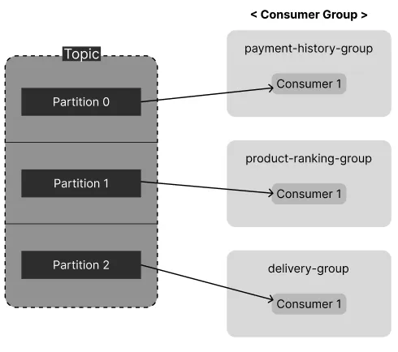
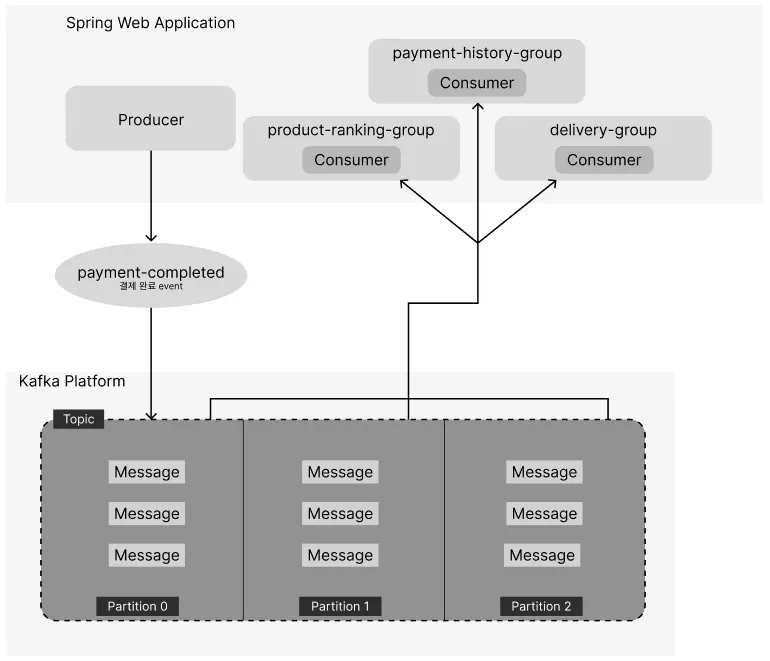
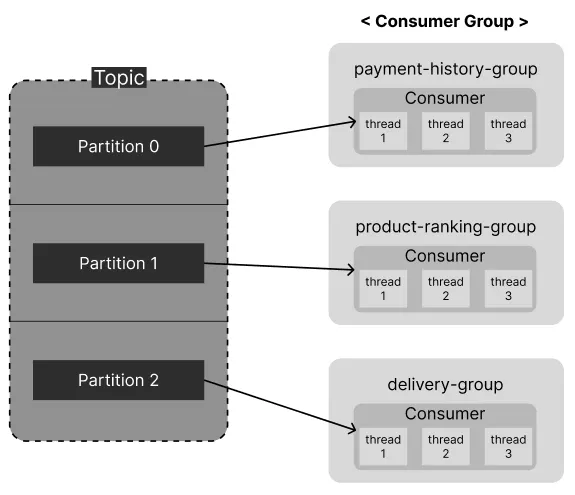
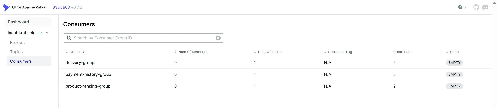

## 기존 구조도

## 개선한 구조도

## Consumer Group 구성

## 코드 개선 사항

### 1. Partition Key 지정을 통한 부하 분산
기존에는 Producer가 key 없이 이벤트를 전달하다 보니, 
모든 메시지가 하나의 파티션에서만 처리되고 있었습니다. 
Partition 1만 메시지를 갖고 나머지 Partition은 유휴 상태로 남아있는 비효율적인 상태였습니다.

이 문제를 해결하고 부하를 분산시키기 위해 **`orderId`를 Partition Key로 지정**했습니다. 
`orderId`를 기준으로 잡으면, 같은 주문 ID를 가진 이벤트가 항상 같은 파티션 내에서 순서대로 처리되는 것을 보장할 수 있어 
유지보수 측면에서 유리하다고 판단했습니다.

결과적으로 메시지 처리 부하가 여러 파티션으로 분산되어 유휴 Consumer 상태가 줄었고, 이를 통해 전체적인 메시지 처리 속도가 향상되었습니다.

### 2. Consumer Thread 확장을 통한 병렬 처리
Consumer 그룹마다 하나의 Consumer만 메시지를 처리하다 보니, 
일하는 파티션을 제외한 나머지 파티션들(2개)이 처리되지 않고 놀고 있는 문제가 있었습니다.

이 문제를 해결하기 위해 두 가지 방법을 고려했습니다.
1.  애플리케이션 인스턴스 자체를 여러 개 실행하는 방식(물리적)
2.  하나의 애플리케이션 내에서 컨슈머 스레드 수를 늘리는 방식(논리적)

인스턴스를 늘리는 것은 인프라를 추가해야 해 비용 부담이 있으므로, 
**단일 애플리케이션 내에서 `concurrency` 옵션으로 스레드 수를 늘리는 두 번째 방식을 선택**했습니다.

이 방식으로 그룹마다 파티션 수(3개)에 맞춰 3개의 스레드가 동시에 메시지를 처리하도록 구성해, 
유휴 파티션 없이 효율적으로 리소스를 사용하고 처리 속도를 높이려 했습니다.